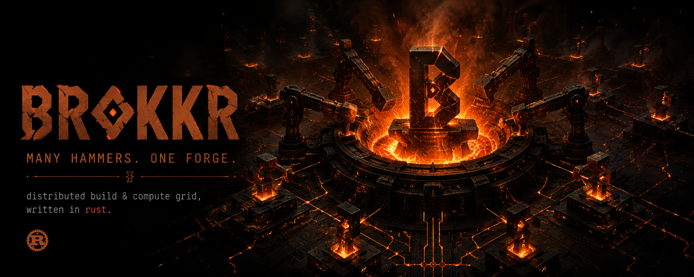

<p align="center">
  
</p>

# Brokkr

**A distributed build & compute grid, written in Rust.**
*Many hammers. One forge.*

Brokkr is a self-hosted, open-source compute platform that turns a fleet of
Linux machines into a single, coherent grid for executing arbitrary jobs —
builds, tests, ML training, transcoding, anything that fits inside a sandbox.
It speaks the [Bazel Remote Execution API v2][reapi] so existing tooling
(`bazel`, `buck2`, `pants`, custom REAPI clients) works unchanged.

The interesting parts of distributed computing — content-addressable
storage, hermetic sandboxing, scheduling, and consensus — are implemented
from scratch as the project's educational core. There is no Docker, no
runc, no embedded etcd, no third-party Raft.

> **Status:** Phases 0–4 complete. A control plane schedules jobs across many
> workers with **platform-constraint matching**, **pluggable strategies**,
> **fault-tolerant job leases** (a crashed worker's job is reassigned and still
> completes), **per-tenant virtual-time fair queuing**, **per-tenant quotas**,
> and **JWT client auth + worker mTLS**. Actions run in a from-scratch
> `brokkr-sandbox` (user/mount/pid/net/UTS namespaces, `pivot_root`, cgroup-v2
> limits + OOM detection, seccomp-bpf, capability dropping). The CAS layer has
> rendezvous-hashing replica routing, a bloom-filtered `find_missing_blobs`
> fast path, a hot-LRU + warm tiered backend, quorum replication,
> reference-counted GC, peer repair, and tree materialisation.
> **Phase 5 (custom Raft for HA) is next. Not yet production-ready.**

## What works today

Run a real two-process cluster and submit a job (see
[`docs/operations/running-a-cluster.md`](docs/operations/running-a-cluster.md)
for the full guide, TLS/auth, and the `scripts/run-cluster.sh` helper):

```sh
# Terminal 1: control plane (gRPC server, redb-backed CAS + action cache).
cargo run -p brokkr-control -- --listen 127.0.0.1:7878 --data-dir /tmp/brokkr

# Terminal 2: a worker that registers, advertises os/arch, and pulls jobs.
# (Run this on more machines to grow the grid; jobs spread + fair-share.)
cargo run -p brokkr-worker  -- --control http://127.0.0.1:7878

# Terminal 3: submit a job.
cargo run -p brokkr-cli -- run --control http://127.0.0.1:7878 -- /bin/echo "hello world"
# → hello world
# → [brokk] exit=0 cache_hit=false

cargo run -p brokkr-cli -- run --control http://127.0.0.1:7878 -- /bin/echo "hello world"
# → hello world
# → [brokk] exit=0 cache_hit=true   ← served from the action cache
```

Behind the scenes that one command:
1. hashes a REAPI `Action` + `Command` and uploads the missing blobs to the CAS,
2. calls `Execute`, which streams a `google.longrunning.Operation`,
3. the scheduler matches the action's platform to an eligible worker, picks one
   via the active strategy, and **leases** the job to it,
4. dispatches a `brokkr.v1.Job` over a bidi gRPC stream; the worker runs it in
   the sandbox and captures stdout/stderr,
5. uploads the outputs back to the CAS,
6. records the result in the action cache (only on `exit_code == 0`),
7. returns an `ExecuteResponse` to the client.

If the worker dies mid-job, its lease is reassigned to another eligible worker
and the job still completes. With auth enabled, clients present a JWT bearer
token whose tenant claim drives fair scheduling and quotas.

## Architecture

Brokkr is a workspace of nine crates with a strict DAG dependency graph.

```
                                         brokkr-cli (binary: brokk)
                                                │
                                                ▼
                                          brokkr-sdk
                                                │
                       ┌────────────────────────┴──────────────────────────┐
                       │                                                   │
                       ▼                                                   ▼
                brokkr-proto  ◀───  brokkr-common  ───▶  brokkr-control (binary: brokkr-control)
                                                                          │
                                                                          ├──▶ brokkr-cas
                                                                          │
                                                                          └──▶ brokkr-worker (binary: brokkr-worker)
                                                                                       │
                                                                                       └──▶ brokkr-sandbox
```

| Crate              | Responsibility                                                                   |
| ------------------ | -------------------------------------------------------------------------------- |
| `brokkr-common`    | Shared `Digest` / `WorkerId` / `JobId` / `TenantId` newtypes, error helpers. Universal dep, kept tiny. |
| `brokkr-proto`     | Vendored REAPI v2 protos + internal `brokkr.v1` worker dispatch + membership protocols. |
| `brokkr-cas`       | `Cas` trait; in-memory + `redb` CAS + action cache; HRW ring, bloom filter, tiered backend, quorum replication, GC, peer repair, tree materialisation. |
| `brokkr-control`   | Tonic gRPC server: REAPI services + worker registry + multi-worker scheduler (matching, strategies, leases, fair queue, quotas) + JWT/mTLS auth. |
| `brokkr-worker`    | Worker daemon: registers, heartbeats, pulls jobs, runs them in the sandbox, uploads outputs. |
| `brokkr-sandbox`   | Linux user/mount/pid/net/UTS namespaces + `pivot_root` + cgroup-v2 + seccomp-bpf + capability dropping, from scratch — no runc, no Docker. |
| `brokkr-sdk`       | Ergonomic Rust client for the REAPI surface.                                     |
| `brokkr-cli`       | The `brokk` command-line interface.                                              |
| `brokkr-test-utils`| Internal test helpers (not published).                                           |

## Engineering invariants

Brokkr aims for correctness > performance > ergonomics, in that order.

- **No `unwrap` / `expect` / `panic!` in library crates.** Errors are
  propagated with `?` against `thiserror` enums. Workspace-level clippy
  lints enforce this (see [`clippy.toml`](clippy.toml)).
- **No `unsafe` without a `// SAFETY:` comment** justifying invariants.
- **No external container runtimes.** The sandbox is built directly on
  the kernel primitives; rolling our own is the educational point.
- **No off-the-shelf Raft.** Phase 5 implements consensus from scratch.
- **Public APIs use `bytes::Bytes`, not `Vec<u8>`.** All IDs are newtypes.
- **CI gate**: `cargo fmt --check`, `cargo clippy --workspace
  --all-targets -- -D warnings`, `cargo test --workspace`, `cargo doc`, and
  `cargo deny` on Linux x86_64 + aarch64.

## Roadmap

The full plan lives in [`docs/plan.md`](docs/plan.md). At a glance:

| Phase | Theme                       | Status                                              |
| ----- | --------------------------- | --------------------------------------------------- |
| 0     | Bootstrap                   | done                                                |
| 1     | First end-to-end slice      | done                                                |
| 2     | Hermetic Linux sandboxing   | done (namespaces, cgroups, seccomp, caps)           |
| 3     | Distributed CAS (sharded)   | done (HRW, bloom, tiered, replication, GC, repair, tree) |
| 4     | Scheduler + multi-tenancy   | done (dispatch, strategies, leases, fair-share, quotas, auth)¹ |
| 5     | Consensus + HA (custom Raft)| next                                                |
| 6+    | Web UI / operator TUI, FUSE inputs, RBE+ | planned                                |

¹ Phase 4's REAPI **Bazel-compatibility** end-to-end test (a real `bazel build`
against `brokk`) and the S3 cold tier / FUSE lazy materialisation are tracked
gaps — see the [Phase 4 retrospective](docs/journal/phase-4.md).

Phase retrospectives are committed to [`docs/journal/`](docs/journal/) at
the close of each phase.

## Quick start (developer)

```sh
# One-time setup (Rust toolchain is pinned via rust-toolchain.toml).
rustup show

# Build everything.
cargo build --workspace

# Run the test suite (gRPC end-to-end + sandbox + CAS + scheduler/auth tests).
# Sandbox tests need a Linux host with unprivileged user namespaces.
cargo test --workspace

# Lint (CI runs the same).
cargo fmt --all --check
cargo clippy --workspace --all-targets -- -D warnings
```

There is also a [`justfile`](justfile) with `fmt`, `lint`, `test`, `ci`,
`brokk`, and `phase` recipes if you have [`just`](https://github.com/casey/just) installed.

## Documentation

- [`docs/plan.md`](docs/plan.md) — vision, architecture, roadmap,
  engineering practice. Single source of truth.
- [`docs/operations/running-a-cluster.md`](docs/operations/running-a-cluster.md)
  — run a real control + worker cluster, submit jobs, enable TLS/auth.
- [`docs/phase-2-plan.md`](docs/phase-2-plan.md) — hermetic sandbox design
  (threat model, re-exec runner, per-subsystem milestones).
- [`docs/phase-3-plan.md`](docs/phase-3-plan.md) — distributed CAS design
  (HRW routing, tiered storage, replication, GC, FUSE).
- [`docs/architecture/`](docs/architecture/) — Architecture Decision Records
  (incl. 0008 multi-worker scheduling, 0009 leases, 0010 tenants/fair
  scheduling, 0011 auth).
- [`docs/journal/`](docs/journal/) — phase retrospectives + per-milestone
  journals.
- [`CHANGELOG.md`](CHANGELOG.md) — every notable change since bootstrap.
- [`CLAUDE.md`](CLAUDE.md) — operating manual when pair-programming with
  AI assistants on this repo.
- [`CONTRIBUTING.md`](CONTRIBUTING.md) — how to propose changes.

## Why "Brokkr"?

In Norse mythology, **Brokkr** is the dwarven smith who, with his brother
Eitri, forges the gods' most prized artifacts in a single furnace —
including Thor's hammer Mjölnir. The grid here is the forge; every
worker is a hammer.

## License

Apache-2.0. See [`LICENSE`](LICENSE).

[reapi]: https://github.com/bazelbuild/remote-apis
